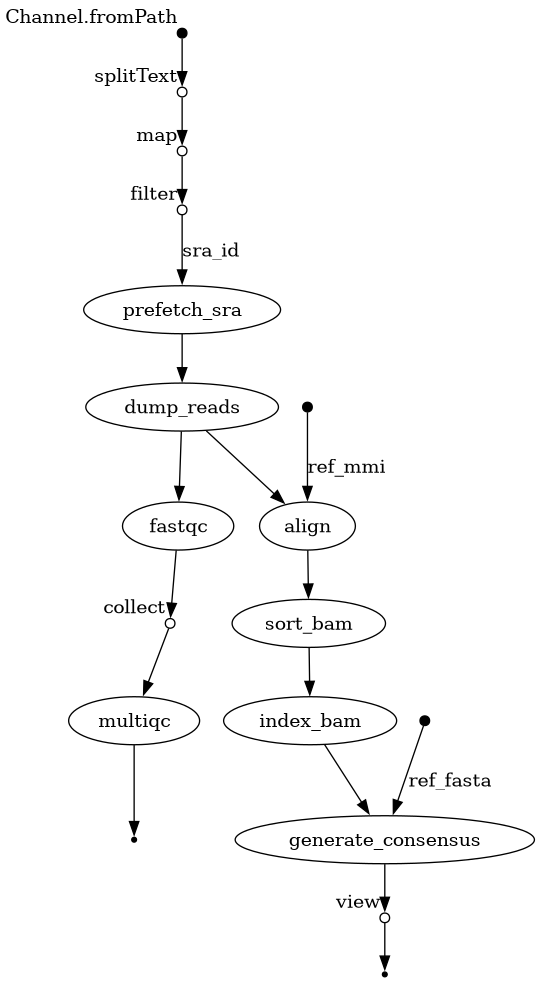
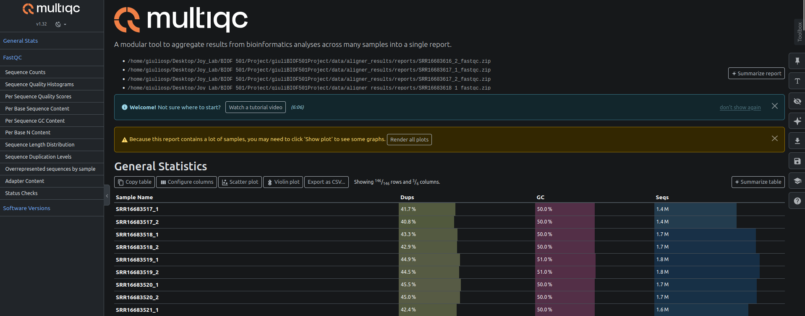
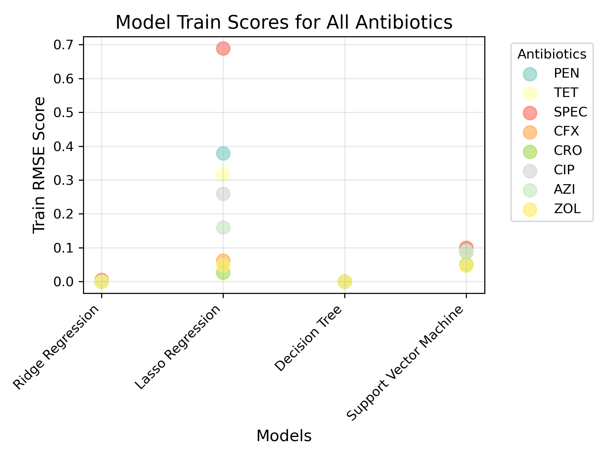
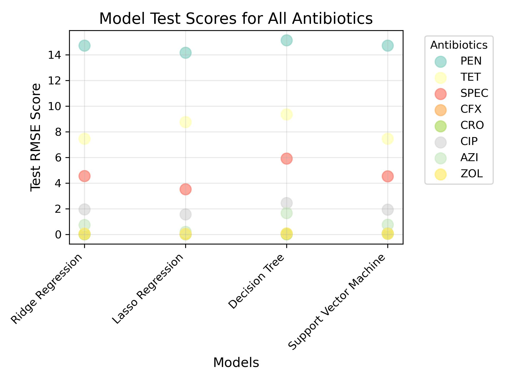

# BIOF 501 Workflow Term Project
## Machine learning prediction of Neisseria gonorrhoeae antimicrobial resistance from genome sequences 

Work by Giuli Sucar.

Based on open source AMRLearn project by Zhang et al. in 2025, applying machine learning (ML) tools to predict bacterial antimicrobial resistance. [1]

Implemented for Neisseria gonorrhoeae (Ghonorrhoea) with chromosome sequences and antimicrobial resistance data from Bristow et al., 2023. [2]

## Background and motivation

Antimicrobial resistance (AMR) is the phenomenon of bacteria evolving resistance to antibiotic medications (aka. antimicrobial). It can occur from mutations in the chromosome, or from acquisition of plasmids that confer such resistance. Since N. gonorrhoeae easily acquires new plasmids, it frequently develops resistance, creating the need for active genomic monitoring of this organism to inform which antibiotics to use as front-line treatments. 

For instance, in May 2025 the Canadian province of British Columbia updated it's guidelines to establish Ceftriazxone (CRO) as the preferred treatment due to growing resistance to the previous regimen, which consisted of the combination Cefixime (CFX) and either Doxycycline (TET) or Azythromycin (AZI). [3] 

The presence of resistance genes in plasmids can be challenging to detect directly because plasmids are more difficult to sequence compared to the bacterial genome. This is due to plasmids being smaller and more dynamic, so the computational step of alignment requires a high sequencing depth. Luckily, AMR plasmids have a slight fitness cost to bacteria, so some chromosome mutations are selected for to compensate. Therefore, variants in some chromosome regions can help predict AMR, just not in a straightforward way. Furthermore, chromosome mutations that confer resistance (not in a plasmid) can be detected directly.

### Aim
My pipeline will help in this work by training preliminary ML models that predict AMR based on chromosome variants of N. gonorrhoeae.

### Objective
Produce a pipeline that automatedly trains ML regression models to predict AMR and plots performance metrics. 

### Hypothesis
Chromosomal sequences are sufficiently correlated with AMR to produce functional ML models and highlight relevant genomic regions.

### Control and Test Groups
With ML analysis, the control group is the training dataset, which is a subset of the data randomly collected for the regression models to train on. The test group is the testing dataset (all the data not used for training) which the ML regresison models attempt to predict the MIC of  (minimum inhibitory concentration, a measure of AMR) based on the sequence's variants, and verifies how accurate their predictions were. 

### Environment
- Nextflow version 25.10.0
- Docker version 20.10.20, build 9fdeb9c
- Custom docker images: 
	- giulisp/mapper:v3
	- giulisp/amrlearn:v3

## Datasets

The resistance of a bacteria to an antimicrobial is commonly measured by a test of Munimum Inhibitory Concentration (MIC), where a colony is exposed to increasing concentrations of each medication. The minimum concentration needed to stop the colony from growing is recorded as the MIC value.

A dataset with N. gonorrhoeae chromosomes (not optimised for plasmid sequences) and MIC tests for each sample were produced by Bristow et al., and will be used to demonstrate this pipeline. [2] The data is accessible under NCBI's BioProject PRJNA776899. For brevity in running this pipeline, I separated 73 out of the 457 samples to run. The samples selected were all samples from Canada and from the Dominican Republic. SRA numbers are listed in the file `/inputs/sra_list.txt` for the pipeline to access.

The reference genome used was the same as in Bristow's journal article, with accession number GCF_000020105.1_ref [2].  

Table 1. N. gonorrhoeae samples included in this pipeline, Sequence Read Archive numbers, country of origin, year collected, anatomic site where sample was collected from, and MIC values for antimicrobials: penicilin (PEN), tetracycline/doxycycline (TET), spectinomycin (SPEC), cefixime (CFX), ceftriaxone (CRO), ciprofloxacin (CIP), azithromycin (AZI), and zoliflodacin (ZOL).

|Sample|SRA|Location|Date|Anatomic Site|PEN|TET|SPEC|CFX|CRO|CIP|AZI|ZOL|
|---|---|---|---|---|---|---|---|---|---|---|---|---|
|AAA001|SRR16683814|Canada|2009|knee fl|0.015|0.25|16|0.002|0.001|0.004|0.125|0.06|
|AAA002|SRR16683803|Canada|2010|NA|0.03|0.25|16|0.002|0.001|0.004|0.125|0.125|
|AAA003|SRR16683792|Canada|2004|Endocervical|0.06|0.125|16|0.008|0.004|0.004|0.06|0.03|
|AAA004|SRR16683781|Canada|2006|uterus|0.06|0.25|16|0.008|0.004|0.004|0.06|0.03|
|AAA005|SRR16683770|Canada|2008|penis|0.25|0.25|32|0.03|0.015|0.008|0.25|0.25|
|AAA006|SRR16683758|Canada|2008|eye|0.06|0.25|16|0.015|0.008|0.004|0.25|0.06|
|AAA007|SRR16683747|Canada|2006|Endocervical|1|2|16|0.03|0.015|0.008|0.5|0.125|
|AAA008|SRR16683736|Canada|2011|Urethral|0.25|1|16|0.015|0.008|0.004|0.06|0.125|
|AAA009|SRR16683642|Canada|2012|Urethral|2|4|16|0.03|0.03|0.015|0.25|0.125|
|AAA010|SRR16683630|Canada|2012|Urethral|0.25|1|16|0.06|0.03|0.015|0.25|0.125|
|AAA012|SRR16683619|Canada|2013|Endocervical|2|1|16|0.03|0.03|0.008|0.25|0.06|
|AAA013|SRR16683578|Canada|2013|Vaginal|0.25|1|16|0.03|0.015|0.015|0.5|0.125|
|AAA015|SRR16683577|Canada|2013|Endocervical|2|4|16|0.125|0.03|16|8|0.125|
|AAA019|SRR16683576|Canada|2013|Urethral|0.25|0.25|16|0.03|0.015|0.008|0.25|0.25|
|AAA020|SRR16683575|Canada|2014|Urethral|0.25|0.5|16|0.008|0.004|0.004|0.03|0.004|
|AAA021|SRR16683573|Canada|2014|Urethral|4|2|16|0.125|0.125|0.015|0.25|0.125|
|AAA022|SRR16683572|Canada|2014|Left Wr|0.25|1|16|0.03|0.015|0.008|0.06|0.125|
|AAA023|SRR16683571|Canada|2014|Urethral|2|2|16|0.125|0.06|8|0.25|0.125|
|AAA024|SRR16683570|Canada|2014|Rectal|0.25|1|16|0.015|0.008|0.004|0.25|0.125|
|AAA025|SRR16683569|Canada|2014|Urethral|0.25|1|16|0.015|0.008|0.008|0.06|0.125|
|AAA026|SRR16683568|Canada|2014|Urethral|0.5|1|16|0.03|0.015|0.015|0.5|0.125|
|AAA027|SRR16683567|Canada|2014|Endocervical|0.125|0.25|16|0.008|0.004|0.004|0.03|0.03|
|AAA028|SRR16683566|Canada|2014|Urethral|0.5|0.5|16|0.015|0.008|0.004|0.125|0.06|
|AAA029|SRR16683565|Canada|2014|Rectal|1|4|16|0.06|0.03|8|0.25|0.06|
|AAA030|SRR16683564|Canada|2015|Urethral|0.25|0.5|16|0.015|0.008|0.004|0.125|0.125|
|AAA031|SRR16683562|Canada|2015|Urethral|0.25|32|16|0.008|0.008|0.008|0.06|0.125|
|AAA033|SRR16683561|Canada|2015|Ankle|0.25|32|16|0.03|0.015|4|0.06|0.06|
|AAA035|SRR16683560|Canada|2015|Blood|0.25|1|16|0.06|0.03|0.008|0.25|0.125|
|AAA036|SRR16683559|Canada|2015|Blood|0.03|0.25|16|0.002|0.001|0.004|0.125|0.06|
|AAA037|SRR16683558|Canada|2015|Urethral|1|1|16|0.03|0.015|0.004|0.25|0.06|
|AAA038|SRR16683557|Canada|2015|Urethral|2|4|16|0.125|0.06|16|0.5|0.125|
|AAA039|SRR16683556|Canada|2015|Urethral|1|1|16|0.03|0.015|0.004|0.125|0.125|
|AAA040|SRR16683555|Canada|2015|Urethral|0.25|0.5|16|0.008|0.004|0.004|0.015|0.008|
|AAA041|SRR16683554|Canada|2017|Urethral|2|4|16|0.25|0.06|16|0.5|0.125|
|AAA042|SRR16683553|Canada|2017|Urethral|2|4|32|0.125|0.06|16|0.5|0.125|
|AAA044|SRR16683523|Canada|2017|Urethral|1|4|32|0.125|0.06|16|0.5|0.125|
|AAA046|SRR16683522|Canada|2017|Urethral|1|4|16|0.125|0.03|16|0.5|0.125|
|AAA047|SRR16683521|Canada|2017|Urethral|0.25|1|16|0.015|0.008|0.008|1|0.125|
|AAA048|SRR16683520|Canada|2017|Urethral|2|4|32|0.25|0.06|16|0.5|0.125|
|AAA049|SRR16683519|Canada|2017|Urethral|4|8|32|0.125|0.06|16|1|0.25|
|AAA050|SRR16683518|Canada|2017|Endocervical|2|4|32|0.25|0.125|16|0.5|0.125|
|BBB032|SRR16683517|Canada|2015|Pharyngeal|1|1|16|0.03|0.015|0.004|0.125|0.06|
|Ng_102|SRR16683729|Dominican Republic|2019-08|Urethral|4|1|16|0.008|0.004|0.5|0.25|0.125|
|Ng_114|SRR16683728|Dominican Republic|2018-09|Urethral|64|1|16|0.008|0.004|4|0.25|0.125|
|Ng_118|SRR16683727|Dominican Republic|2019-08|Urethral|8|32|16|0.03|0.015|1|0.125|0.06|
|Ng_123|SRR16683726|Dominican Republic|2019-08|Urethral|64|1|16|0.008|0.004|4|0.25|0.125|
|Ng_126|SRR16683640|Dominican Republic|2019-08|Urethral|64|1|16|0.008|0.004|4|0.25|0.125|
|Ng_128|SRR16683639|Dominican Republic|2019-08|Urethral|8|32|16|0.015|0.008|1|0.25|0.06|
|Ng_129|SRR16683638|Dominican Republic|2019-08|Urethral|64|1|16|0.008|0.004|4|0.125|0.06|
|Ng_131|SRR16683637|Dominican Republic|2019-08|Urethral|64|1|16|0.008|0.004|4|0.25|0.125|
|Ng_133|SRR16683636|Dominican Republic|2019-08|Urethral|64|0.5|16|0.008|0.004|4|0.125|0.125|
|Ng_134|SRR16683635|Dominican Republic|2019-08|Urethral|64|0.5|16|0.008|0.004|0.004|0.25|0.125|
|Ng_136|SRR16683634|Dominican Republic|2019-08|Urethral|64|1|16|0.015|0.008|4|0.25|0.125|
|Ng_140|SRR16683633|Dominican Republic|2019-09|Urethral|16|1|16|0.03|0.015|2|0.125|0.06|
|Ng_141|SRR16683632|Dominican Republic|2019-09|Urethral|64|1|16|0.015|0.008|4|0.25|0.125|
|Ng_144|SRR16683631|Dominican Republic|2019-09|Urethral|64|0.5|16|0.008|0.004|4|0.125|0.125|
|Ng_148|SRR16683629|Dominican Republic|2019-09|Urethral|64|1|16|0.015|0.008|4|0.125|0.125|
|Ng_151|SRR16683628|Dominican Republic|2019-09|Urethral|64|1|16|0.008|0.004|4|0.25|0.125|
|Ng_154|SRR16683627|Dominican Republic|2019-09|Urethral|64|1|16|0.008|0.004|4|0.25|0.125|
|Ng_162|SRR16683626|Dominican Republic|2019-10|Urethral|64|1|16|0.008|0.004|4|0.25|0.125|
|Ng_163|SRR16683625|Dominican Republic|2019-10|Urethral|64|1|16|0.015|0.008|4|0.25|0.125|
|Ng_165|SRR16683624|Dominican Republic|2019-10|Urethral|64|1|16|0.008|0.004|4|0.25|0.125|
|Ng_171|SRR16683623|Dominican Republic|2019-10|Urethral|8|1|16|0.03|0.015|4|0.125|0.06|
|Ng_175|SRR16683622|Dominican Republic|2019-10|Urethral|64|1|16|0.015|0.008|4|0.03|0.004|
|Ng_176|SRR16683621|Dominican Republic|2019-10|Urethral|64|1|16|0.008|0.004|4|0.125|0.06|
|Ng_180|SRR16683620|Dominican Republic|2019-11|Urethral|8|1|16|0.03|0.015|1|0.125|0.06|
|Ng_183|SRR16683618|Dominican Republic|2019-11|Urethral|64|1|16|0.015|0.008|4|0.25|0.125|
|Ng_188|SRR16683617|Dominican Republic|2019-11|Urethral|64|4|16|0.015|0.015|8|0.25|0.125|
|Ng_25|SRR16683616|Dominican Republic|2019-02|Urethral|4|1|16|0.015|0.008|4|0.125|0.125|
|Ng_30|SRR16683615|Dominican Republic|2018-03|Urethral|4|0.5|16|0.015|0.008|2|0.03|0.015|
|Ng_54|SRR16683614|Dominican Republic|2019-05|Urethral|32|64|16|0.008|0.008|4|0.125|0.125|
|Ng_74|SRR16683580|Dominican Republic|2019-06|Urethral|16|32|16|0.06|0.03|2|0.125|0.125|
|Ng_91|SRR16683579|Dominican Republic|2019-07|Urethral|32|1|16|0.008|0.004|4|0.25|0.125|

## SOP (Usage)

This pipeline is split into two workflows: Mapper and AMRlearn. With Mapper run first and AMRlearn run second. 
The workflows are split to allow a faster run without pre-processing SRA files, and because the environments they require have incompatible packages.  

1. Running Mapper and then AMRlearn, with ample computing resources.
```
# Run Mapper
nextflow Nextflow.mapper/mainV2.nf -with-docker -c Nextflow.mapper/nextflow.config

# Run AMRlearn 
nextflow Nextflow.amrlearn/main.nf -with-docker -c Nextflow.amrlearn/nextflow.config
```

2. Validating Mapper with few samples, and running AMRlearn with pre-processed FASTA files (by Mapper)
```
# Run Mapper validation with few samples
nextflow Nextflow.mapper/mainV2.nf -with-docker -c Nextflow.mapper/nextflow.config --sra_path "inputs/sra_list_small.txt"

# Run AMRlearn with pre-processed FASTA files
nextflow Nextflow.amrlearn/main.nf -with-docker -c Nextflow.amrlearn/nextflow.config --fasta_dir "outputs/example_outputs/mapper_results/fasta" 
```

### Mapper (run first)
- Location: `/Nextflow.mapper` 
- Takes SRA accession numbers (in `sra_list.txt`), downloads the .sra files, then maps them to a reference genome (accession GCF_000020105, same as in the Bristow paper [2]) to produce consensus FASTA files. 
- If computational resources are limited, skip this workflow and use consensus fasta files pre-compiled in `outputs/Example outputs/mapper_results/fasta`.
- Its inputs are `sra_list.txt` and a reference genome in .fna and .mmi formats. Inputs paths are set as parameters: 
	params.ref_fasta = "../inputs/GCF_000020105.1_ref/GCF_000020105.1_ASM2010v1_genomic.fna"
	params.ref_mmi = "../inputs/GCF_000020105.1_ref/GCF_000020105.1.mmi"
	params.sra_path = "../inputs/sra_list.txt"
- It's outputs are:
	- A `/reports` directory (with fastQC reports on each fastq file and a compiled MultiQC report on the whole dataset)
	- A `/fasta` directory with all contructed consensus sequences. 
	- Output directory path is set by one parameter `--params.outdir "../outputs/mapper_results"`
- Environment:
	- Custom docker container with the environment for linux Ubuntu 22.04.5 LTS is in `giulisp/mapper:v2` and is listed in the nextflow.config file, so it can be applied by adding `-with-docker` to the nextflow command.  
	- Conda environment for linux Ubuntu 22.04.5 LTS is in `Nextflow.mapper/mapper.yml`. To use the conda environment, first create a local environment from the `mapper.yml` file with `conda create --name [environment name] mapper.yml` then activate it with `conda activate [environment name]`.





### AMRlearn (run second)
- Location: `/Nextflow.amrlearn` 
- Example run with Nextflow 25.10.0 skipping Mapper due to limited computational resources:
```
nextflow Nextflow.amrlearn/main.nf --fasta_dir "../outputs/example_outputs/mapper_results/fasta" -with-docker
```
- Trains various ML models for AMR prediction based on bacterial chromosome sequences, then exports all trained models and their evaluations.
- Its inputs are a gbff reference (same as the one for Mapper, but with a different format), the directory with consensus fasta files from samples, a tab-separated table of MIC values with one row per sample and one column per antibiotic, a threshold for ploting genes that matter to predictions, and a user-set name for the project. Inputs values and paths are set as parameters:    
	params.ref_gbff_path = "../inputs/GCF_000020105.1_ref/GCF_000020105.1.gbff"
	params.fasta_dir = "../outputs/mapper_results/fasta"
	params.antibiotics = "../inputs/PRJNA776899.antibiotics.txt"
	params.threshold = 0.08 //threshold for filtering absolute coefficient
	params.project = "PRJNA776899"
- Its outputs are:
	- A `/[project name].learn` with pickle files (standard export format) of each model, lists of regions with coefficients above threshold for each model, model-specific plots of regions with coefficients above threshold, plots comparing all models, and run logfiles.
	- A `/[project name].parsnp` directory with an intermediate vcf file generated for all fasta files
	- Intermediate files (a tab file linking locus tags and positions, a SNP count noting frequencies of mutation features and a feature2target file noting the correlations between mutation features and each MIC target). 
	- Output directory path is set by the parameter	`--params.outdir "../outputs/amrlearn_results"`
- Environment:
	- Custom docker container with the environment for linux Ubuntu 22.04.5 LTS is in `giulisp/amrlearn:v3` and is listed in the nextflow.config file, so it can be applied by adding `-with-docker` to the nextflow command.  
	- Conda environment for linux Ubuntu 22.04.5 LTS is in `Nextflow.amrlearn/amrlearn.yml`. To use the conda environment, first create a local environment from the `amrlearn.yml` file with `conda create --name [environment name] amrlearn.yml` then activate it with `conda activate [environment name]`.


## Expected results

### Mapper
Expected results for Mapper include the fasta directory `/outputs/mapper_results/fasta` with FASTA files for all SRA samples listed as an input. The quality of these files is reported in `outputs/mapper_results/reports`, especially in the file `multiqc_report.html` that summarizes all reports. An example is shown in the image below.  



### AMRlearn
Expected results are models and their evaluations in the amrlearn output directory, `/outputs/amrlearn_results/[project name].learn` by default. Below are examples of output evaluation plots and how to interpret them.

- Training comparison across models using RMSE (root mean squared error). A low RMSE score indicates an accurate regression, with a small cumulative difference between predicted and actual MIC values. Note that scores are low for all models except Lasso Regression, because those models are prone to overfitting on training data. 


- Testing comparison across models using RMSE. Note that performance is more affected by the antibiotic than model type, indicating that some antibiotics are harder to predict with chromosome data. For intance, Penicilin (PEN) and Tetracycline (TET) are especially challenging, which is expected biologically as their resistance genes are plasmid-borne, and therefore not easily derrived from chromosome sequences.     
 

- Cross validation (CV) subsamples random portions of the training data to evaluate the impact of training data randomization. The models for which CV scores differ from each other and from test scores are dependent on the training data used, so they are likely less reliable and would benefit from more input data. Note that this is the case for TET Ridge, PEN Ridge, PEN Decision Tree and PEN Support Vector Machine.
 

- Model-specific plot of all regions wih coefficients above threshold (in absolute value). These can only be produced for Lasso Regression and Ridge Regression, as other models do not produce independent coefficients for each region. If no regions are found with sufficient threshold for a given model, the plot is not produced. Below is the example for antibiotic CIP with Lasso Regression. Note that one region (GK_RS1195) has a more expressive coefficient, which aligns with the original paper stating that all CIP resistant samples had mutations in the gyrA gene [2].
 

The quality of models and region plots relies on the input data having many examples of resistant and non-resistant samples for each antibiotic. Given the smaller dataser selected for this demonstration, the quality is not ideal for models of AZI, CRO and ZOL. Zoliflodacin (ZOL) is a new antibiotic and therefore no resistance was observed in any sample. 


## Sources
[1] Zhang, Xi, et al. "AMRLearn: Protocol for a machine learning pipeline for characterization of antimicrobial resistance determinants in microbial genomic data." STAR protocols 6.2 (2025): 103733.

[2] Bristow, Claire C et al. “Whole-Genome Sequencing to Predict Antimicrobial Susceptibility Profiles in Neisseria gonorrhoeae.” The Journal of infectious diseases vol. 227,7 (2023): 917-925. doi:10.1093/infdis/jiad027

[3] British Columbia Centre for Disease Control.
British Columbia Treatment Guidelines: Uncomplicated Gonorrhea Infection in Adults & Adolescents. Provincial Health Services Authority, May 2025. https://www.bccdc.ca/resource-gallery/Documents/Educational%20Materials/STI/Med%20Handouts/GC_Guidelines.pdf.


## License

[MIT](https://choosealicense.com/licenses/mit/)